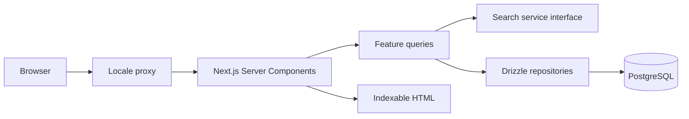

# Architecture

## Context

Šapa is an SEO-first marketplace with localized taxonomy, moderation-sensitive trust features, and two service-booking domains. Phase 0 and Phase 1 establish the platform and homepage only.

## Decisions

- **Next.js App Router:** public content renders in Server Components; only tabs, mobile navigation, and retry boundaries ship client JavaScript.
- **PostgreSQL + Drizzle:** SQL migrations remain reviewable, while PostgreSQL full-text/trigram search and partial indexes stay available without ORM escape-hatch friction.
- **Better Auth:** email/password and Google are delegated to a maintained authentication library. Auth flows are deferred.
- **next-intl:** URL-aware locale configuration uses `sr-Latn` by default and centralizes all UI strings.
- **Repository boundaries:** pages call feature queries; queries call repositories; repositories own Drizzle. Search and image storage sit behind interfaces so infrastructure can change.
- **Progressive enhancement:** searchable content and navigation work without client JavaScript. Client caching is reserved for later high-frequency interactions.

## Runtime flow

## Privacy and security

Public profiles are separated from private verification documents. Inputs are validated at server boundaries. Reports and moderation actions are auditable, while user-facing records support deletion or anonymization. Secrets are environment-only. Country-scoped legal requirements avoid encoding one jurisdiction's animal-welfare rules as universal assumptions.

## Deferred decisions

Object storage vendor, transactional email provider, production hosting, Sentry activation, external search, payments, and booking concurrency policies are intentionally deferred.
