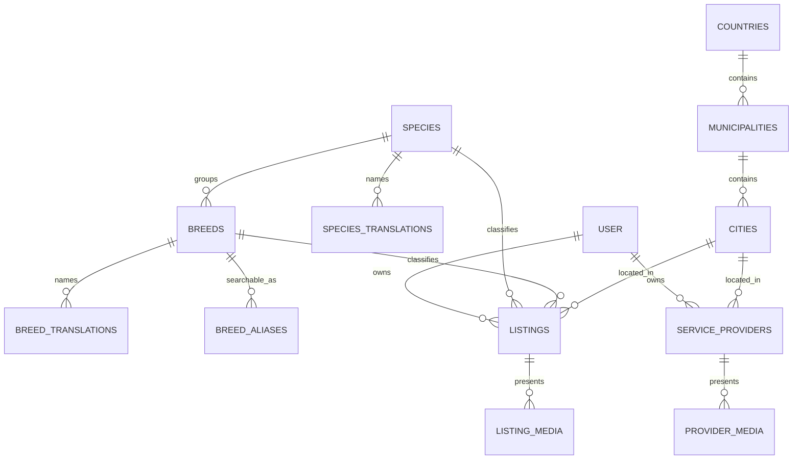

# Data model

## Principles

- Species, breeds, translations, and aliases are rows—not source-code enums.
- Public, private, and moderation data have separate ownership boundaries.
- Listings retain explicit lifecycle timestamps for moderation and SEO.
- Migrations only contain tables needed by the current or immediately next phase. Later models live in [`FUTURE_DATA_MODEL.md`](FUTURE_DATA_MODEL.md) until their phase starts.

## Foundation schema

`user` is a minimal owner identity (name, email, soft-delete timestamp). Sessions, accounts, and profiles are added with authentication.

## Important indexes and constraints

- Unique slugs for public listings and providers.
- Unique `(species_id, slug)` breeds and `(entity_id, locale)` translations.
- Diacritic-insensitive search: `normalize_search_text(text)` (built on `unaccent`, maps `đ` to `dj`) feeds generated `search_name` columns on `species_translations`, `breed_translations`, and `cities`, and the generated `breed_aliases.normalized_alias`. Each has a `pg_trgm` GIN index serving `LIKE '%q%'` and similarity (`%`) lookups.
- `*_slug_ascii` check constraints restrict public slugs (`species`, `breeds`, `municipalities`, `cities`, `listings`, `service_providers`) to `^[a-z0-9]+(-[a-z0-9]+)*$`.
- Partial listing feed index over active records ordered by publication time.
- Composite filter index for status/type/species/breed/city.
- At most one primary media item per listing.
- Checks for non-negative listing prices and ages and positive provider capacity.

See `db/schema/` for the executable source of truth.
