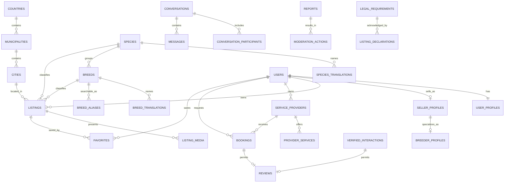

# Data model

## Principles

- Species, breeds, translations, and aliases are rows—not source-code enums.
- Public, private, and moderation data have separate ownership boundaries.
- Listings retain explicit lifecycle timestamps for moderation and SEO.
- Reviews require a completed booking or verified marketplace interaction.
- Legal requirements are scoped by country, species, and listing type.

## Important indexes and constraints

- Unique slugs for public listings and providers.
- Unique `(species_id, slug)` breeds and `(entity_id, locale)` translations.
- Trigram GIN indexes for translated taxonomy names and aliases.
- Partial listing feed index over active records ordered by publication time.
- Composite filter indexes for status/type/species/breed/city.
- Unique favorites and conversation participants.
- Checks for prices, ratings, date ranges, review evidence, and report targets.
- GIST-friendly booking date fields are present; hard capacity enforcement is deferred until booking implementation.

See `db/schema/` for the executable source of truth.
